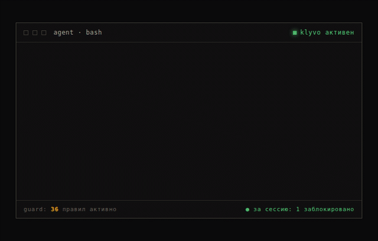

# Klyvo — guard для вайб-кодинга

Перехватывает разрушительные для базы данных команды до того, как их выполнит
агент (Claude Code). Критичное (удаление таблиц, массовое удаление, сброс
миграций) блокирует, на остальное просит подтверждение. Работает даже когда
агент запущен в режиме автоодобрения. Каждую перехваченную команду пишет в журнал.



## Установка

```bash
curl -fsSL https://klyvo.tech/install.sh | sh
```

Другой агент — параметром: `| sh -s -- cursor` (см. [список](#поддерживаемые-агенты)).

Не любите запускать скрипты из интернета — правильно делаете, это ровно тот
сценарий, от которого Klyvo и защищает. [install.sh](install.sh) короткий, его
можно прочитать целиком, а можно поставить руками теми же тремя командами:
[INSTALL.md](INSTALL.md).

---

**English.** Klyvo blocks destructive database commands — `DROP`, `TRUNCATE`,
`DELETE` without `WHERE`, migration resets — before your AI coding agent runs
them. Runs locally as a pre-execution hook, makes no network calls, and works
even in auto-approve mode. Install with the command above. Documentation below
is in Russian; issues and pull requests in English are welcome.

---

## Почему не хватает встроенных чекпоинтов

У Claude Code (`/rewind`) и Cursor (Checkpoints) есть свой откат, но у него две дыры:

1. он не видит команды, выполненные через bash, а миграции, `psql` и прочий CLI — это почти всегда bash;
2. он не трогает ничего за пределами файлов: удалённую строку в БД, отправленный API-запрос или уже прошедший деплой откат файлов не вернёт.

Klyvo срабатывает до выполнения команды, поэтому закрывает этот пробел.

## Как это работает

`.claude/hooks/guard.py` подключается как `PreToolUse`-хук на инструмент `Bash`
(см. `.claude/settings.json`). Сам хук тонкий: логика детекции лежит в общем
ядре `klyvo/rules.py` (49 правил и 2 эвристики), чтобы её можно было
переиспользовать в адаптерах под Cursor и Codex.

Что покрывают правила: чистый SQL (`DROP`/`TRUNCATE`/`ALTER ... DROP COLUMN`),
`DELETE`/`UPDATE` без ограничивающего `WHERE` (включая обманки `WHERE 1=1` и
`WHERE true`), CLI СУБД (`dropdb`, `mysqladmin drop`), миграционные фреймворки
(Prisma, Rails, Django, Alembic, Knex, Sequelize, Goose, TypeORM, dbmate),
облачные БД (`supabase db reset`, D1, Turso), NoSQL (`.drop()`, `dropDatabase()`,
`deleteMany({})`, `FLUSHALL`) и инфраструктуру с данными (удаление
`.sqlite`-файлов, `docker volume rm`, `kubectl delete pvc`, `terraform destroy`), а также разрушительные операции у хостинг-провайдеров,
где живут базы: удаление томов и сервисов Railway (включая прямые мутации
к его API), Fly.io, Render и Heroku, инстансов AWS RDS и Cloud SQL, таблиц
DynamoDB и рекурсивную очистку бакетов S3.

У каждого правила есть уровень. Критичное хук блокирует жёстко: команда не
выполнится даже в режиме автоодобрения. Предупреждение (удаление индекса,
колонки) вызывает запрос подтверждения. Любое срабатывание пишется в
`.klyvo/journal.jsonl`.

Ограничение, выбранное осознанно в пользу безопасности: правила смотрят на текст
команды, поэтому ключевое слово в строке или комментарии (например
`git commit -m "... drop table ..."`) тоже вызовет реакцию. Если конкретная
команда в проекте безопасна, занесите её в `allowlist`; так и убирают ложные
срабатывания.

## Настройка (`.klyvo/config.json`)

Поведение правил настраивается файлом `.klyvo/config.json` в корне проекта, все
поля необязательны:

```json
{
  "disabled_rules": ["sql_drop_index"],
  "allowlist": ["^scripts/reset_dev\\.sh"],
  "custom_rules": [
    {"name": "no_prod_seed", "severity": "critical",
     "pattern": "seed\\.py --env=prod", "description": "Сид прод-базы"}
  ]
}
```

- `disabled_rules` — правила и эвристики (`sql_delete_no_where`, `sql_update_no_where`), которые нужно выключить.
- `allowlist` — список regex. Если команда совпала хоть с одним, Klyvo её не сканирует.
- `custom_rules` — свои паттерны под проект. Битое правило игнорируется, скан не падает.

Если config битый или отсутствует, Klyvo работает на базовых правилах.

## CLI правил

```
python3 klyvo_rules.py list                 # действующие правила (с учётом config)
python3 klyvo_rules.py test "DROP TABLE x"  # что сработает на команде и почему
```

## Сквозной журнал сессии

`.claude/hooks/journal.py` подключается как `PostToolUse`-хук на все инструменты
и пишет каждое действие агента (команды, правки файлов) в
`.klyvo/session_log.jsonl`. Всё остаётся локально на диске, никуда не отправляется.
Перед записью текст команд проходит маскировку секретов (`klyvo/redact.py`):
пароли, токены и ключи заменяются на `***`, чтобы не оседать в журнале. Отдельная
команда собирает из этого сводку, без нейросети:

```
python3 klyvo_journal.py            # последняя сессия
python3 klyvo_journal.py --all      # все сессии
python3 klyvo_journal.py --session <id>
```

Пример вывода:

```
═══ Сводка сессии Klyvo ═══
Всего действий агента: 6
Изменённые файлы (2):
  • app/main.py — 2 правки
  • app/db.py — 1 правка
Выполненные команды (2):
  • npm install
  • npm test
⚠ Перехвачено опасных операций с данными: 1
  • psql -c 'DROP TABLE users;'
    └ Удаление таблицы/базы/схемы (DROP) — потребовано подтверждение
```

### Экспорт для отправки (например, тестировщиком)

```
python3 klyvo_journal.py --export              # klyvo-export-<время>.json рядом с .klyvo
python3 klyvo_journal.py --export path/out.json
```

Отправка — только вручную, ты сам решаешь, кому и когда. Файл собирается локально:
`cwd` и абсолютные пути (правки/чтения файлов) не попадают в него вовсе, остаётся
только имя файла; пароли/токены/ключи маскируются `klyvo/redact.py` повторно (на
случай, если что-то не замаскировалось при первой записи). Это блок-лист по
известным форматам, а не гарантия на 100% — текст самой команды (например,
доменное имя БД в connection-string) остаётся видимым для контекста. **Открой
файл и просмотри его глазами, прежде чем отправлять.**

## Веб-дашборд

Локальный дашборд показывает перехваченные команды и активность сессии в браузере:

```
python3 klyvo_web.py                       # текущий проект, http://127.0.0.1:8765
python3 klyvo_web.py --project ~/app --port 9000
```

Слушает только `127.0.0.1`, читает данные из `.klyvo/`, наружу ничего не
отправляет, без внешних зависимостей. Первая простая версия — дальше будет
обрастать настройками (правила, политика deny/ask).

## Тесты

```
python3 tests/all.py           # прогнать всё разом

python3 tests/run_tests.py     # guard: 25 опасных + 14 безопасных команд
python3 tests/test_journal.py  # журнал: запись событий, рендер сводки, --export
python3 tests/test_config.py   # правила: config (disable/allowlist/custom) + многострочный WHERE
python3 tests/test_redact.py   # маскировка секретов (URL/KEY=/флаги/JSON/форматы ключей)
python3 tests/test_cursor.py   # адаптер Cursor
python3 tests/test_install.py  # установщик хуков: запись, идемпотентность, --uninstall
python3 tests/test_web.py      # сбор данных для дашборда, локальная авторизация (пароль + сессии)
python3 tests/test_agents.py   # адаптеры Codex/Kimi/opencode
python3 tests/test_opencode_plugin.py  # JS-плагин opencode исполняется в node
```

Тесты симулируют формат `PreToolUse`/`PostToolUse`-событий из
`code.claude.com/docs/en/hooks`. Оба хука проверены и живым запуском в
headless-сессии Claude Code.

## Сломалось или сработало не на том

Ложное срабатывание — главная причина молча удалить инструмент, поэтому о нём
особенно важно сообщить: правила сигнатурные, и безобидная команда с триггерным
словом внутри действительно может быть перехвачена.

- Ложное срабатывание или пропущенная опасная команда —
  [заведите issue](https://github.com/matrixfuck/klyvo/issues/new/choose),
  там есть готовые шаблоны.
- Не хотите публично — напишите на support@klyvo.tech.

Быстрый обход, пока разбираемся: добавьте команду в `allowlist` в
`.klyvo/config.json` (см. [настройку](#настройка-klyvoconfigjson)) — скан её
пропустит, остальные правила продолжат работать.

## Версия

Klyvo в бете, v0.7.2. Основное уже работает: перехват с блокировкой критичного,
запрос подтверждения на предупреждения, журнал сессии, веб-дашборд с входом
(вкладки, поиск, фильтры, панель правил), лендинг [klyvo.tech](https://klyvo.tech),
адаптеры под 6 агентов. Дальше будет много обновлений. Историю версий смотрите
в [CHANGELOG.md](CHANGELOG.md).

## Поддерживаемые агенты

Ядро детекции (`klyvo/rules.py`) и слой журнала и подтверждения
(`klyvo/adapter.py`) общие, под каждый инструмент нужна лишь тонкая обёртка.
Важное следствие: **Klyvo перехватывает инструмент, а не модель**. Если DeepSeek
(или любая другая модель) работает *внутри* Claude Code, Cursor или их форка —
он уже под защитой, отдельная поддержка не нужна.

Живая проверка блокировки подтверждена на Claude Code. У остальных адаптеры
собраны по официальной спеке хуков конкретного инструмента и покрыты юнит-тестами
(`tests/test_agents.py`, `tests/test_cursor.py`) — но живой тест на реальном
агенте ещё впереди. Это бета: возможны баги, особенно на свежих адаптерах.
Нашли один — заведите issue, это ускоряет переход адаптера в проверенный статус.

| Агент | Как | Статус |
|---|---|---|
| Claude Code | `PreToolUse`/`PostToolUse`, `install_hooks.py` | ✅ подтверждено вживую |
| DeepSeek-Code и форки Claude Code (Langcli, Crush, Oh My Pi) | тот же контракт хуков, `--tool deepseek-code` или `--tool claude-compatible --path <settings.json>` | 🟡 тот же контракт хуков, что у Claude Code — живой тест впереди |
| Kimi Code CLI | `[[hooks]]` в `config.toml`, тот же `guard.py` (формат хуков как у Claude Code), `--tool kimi` | 🟡 по официальной спеке хуков — живой тест впереди |
| Codex CLI | свой адаптер (плоский `deny`), `hooks.json` + флаг `codex_hooks`, `--tool codex` | 🟡 свой адаптер под формат Codex — живой тест впереди |
| Cursor | `beforeShellExecution`, `--tool cursor` | 🟡 по спеке `beforeShellExecution` — живой тест впереди |
| opencode | плагин на JS (`tool.execute.before`), зовёт ядро правил, `--tool opencode` | 🟡 экспериментальный JS-плагин — живой тест впереди |
| Агенты на Codex-архитектуре (DeepSeek-TUI, Reasonix) | свой формат хуков | ⛔ пока не поддержаны — другой формат хуков |

Установщик вычисляет пути от расположения репозитория, поэтому работает из любой
копии — локальной или синхронизированной между машинами:

```
python3 tools/install_hooks.py                             # Claude Code → ~/.claude/settings.json
python3 tools/install_hooks.py --tool deepseek-code        # DeepSeek-Code → ~/.deepseek-code/settings.json
python3 tools/install_hooks.py --tool kimi                 # Kimi Code → ~/.kimi-code/config.toml
python3 tools/install_hooks.py --tool codex                # Codex CLI → ~/.codex/hooks.json + флаг
python3 tools/install_hooks.py --tool cursor               # Cursor → ~/.cursor/hooks.json
python3 tools/install_hooks.py --tool opencode             # opencode → плагин на JS
python3 tools/install_hooks.py --tool claude-compatible --path ~/.мой-форк/settings.json
# --uninstall убрать, --dry-run посмотреть без записи
```

Почему форки Claude Code работают тем же хуком: они наследуют формат
`PreToolUse`/`PostToolUse` (команда в `tool_input.command`, ответ через
`permissionDecision`). Отличается только путь к конфигу и то, что форки не
задают `CLAUDE_PROJECT_DIR` — поэтому guard берёт корень проекта из `cwd`.
